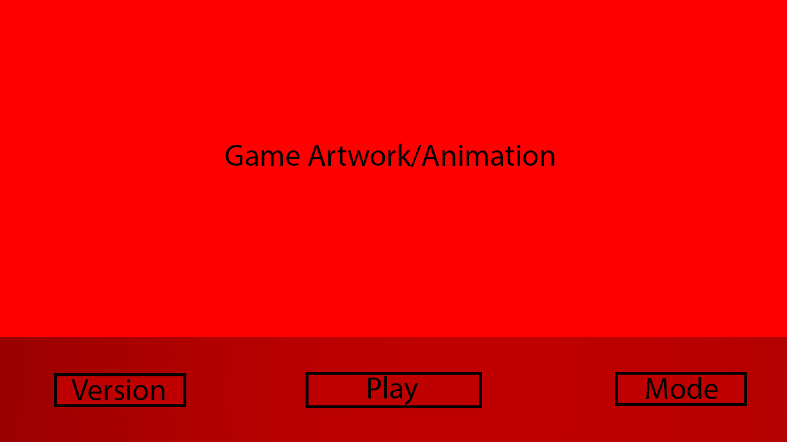

# Game Launcher Exam

## Introduction
This is a project for my Tools Programming exam during my 5th semester.

In this project I will incorporate these points:

- Implement a game launcher that updates the game on request
- Contain documentation
- Code written in C# and XAML
- WPF as GUI
- Launcher should be able to *launch* the game
- Unit tests with atleast 30% coverage

I also decided to include these optional points:

- Launcher can be set to keep game updated every time it is run
- Use git as a version control system

## Planning
Before I started writing anything, I decided to make a plan. I made a sketch of the design,
and planned out the basic functionality I wanted in my project.

This is what I ended up with:  

Visualizing the way I want it to turn out first, makes it easier to code afterwards.
This is because I now have a clear goal in mind when I code. I would explain it like this:  
> *Finding your way from start to finish is easier on a path of light, than in complete darkness.*

### High level overview
The application is a template for a game launcher that can automatically update to the latest version.  
The user is also able to choose between all available versions.   
Available versions are automatically found and added at to the list app launch.

### Design

I decided to use the MVVM design pattern, and tried to stay as true to the pattern as possible.

## Features

Current features include:

- *Launching* the game
- Changing versions of the game *(Currently three premade versions)*
- Settings window
- Setting: Change volume
- Setting: Mute volume
- Setting: Auto update to newest version available
- Saving and loading settings on device with JSON serializing

There is definitely room for improvement for some of the features, I will mention more about that later.

### Challenges
The largest challenge, but also biggest learning experience during the development of this project was definitely the use of custom events.   
At first it seemed very confusing, b ut when you understand how it works and how to implement them, they become extremely useful.   
   
I also struggled for a while to open a .txt application with a button, but after some research I was able to find a solution.

### Satisfactory results
I am very satisfied with the design of the game launcher itself and the way it is presented.   

I am also satisfied with the use of custom events in this project.

## Further development
There is large room for improvement in this project.

### Better version control
Currently the project will choose the "latest" version as the one with the largest number.   

In theory this is fine, as 2.0.0 is larger than 1.9.9.  
However, an issue can arise if the version numbers exceed a single digit.  
Currently the function will look at version 2.0.0 and 1.9.9 and turn them into the numeric values 200 and 199.   
200 is larger than 199, but what happens if the versions are 2.0.0 and 1.0.10 instead?   
2.0.0 should is still newer than 1.0.10, but the number 200 is smaller than 1010.

For further development, I would try to make the earlier numbers be more significant to prevent this issue from arising.

### Actually launching games
Currently the application only launches a .txt file with individual content to simulate launching a game.

For further development, I would make it launch an actual .exe file for different versions of a test game.

### Local folders replaced with a database
Currently the project has a Versions and Resources folder dedicated to the different "versions" and their resources.

For further development, I would create an online database with actual versions and the versions file.  
I would still show all available versions in a list, but only have the current version's resources actually downloaded locally.  
If the user chooses a different version, it will download/update the current version to the newly selected version.

### Safety checks
There aren't enough tests and checks in this project.  

For further development, I would create more checks that would prevent these kinds of situations:

- Trying to launch the game without having a version selected
- Errors if application can't find version(s) or resources for the selected version

### Cross-platform compatability
The project is currently using WPF as a GUI.   
This means only devices using Windows will be able to use the launcher.

For further development, I would try to completely revamp the project with a cross-platform compatible GUI. 